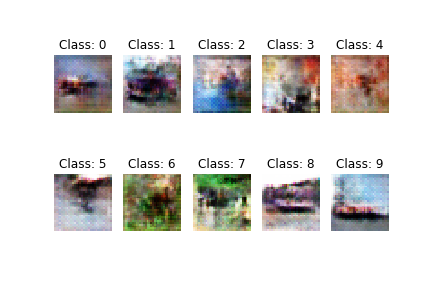
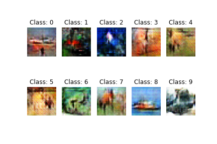
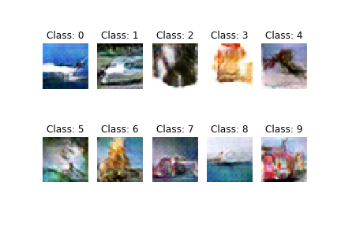
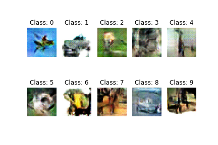
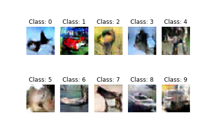

# Conditional-GAN-CIFAR-10

<b>Conditional GAN implemented on the CIFAR-10 dataset</b>

The dataset CIFAR-10 was downloaded using Keras library.
The dataset is available here : https://www.cs.toronto.edu/~kriz/cifar.html

Problem Statement : Implement Conditional GAN for CIFAR-10 dataset containing images belonging to 10 classes.

<b><h3>Approach :</h3></b>

 The datasets have been combined for better training of the Conditional GAN.
 Batch size has been taken as 50. Image size has been taken as 32x32.

<b>Generator Architecture</b>
 Noise taken as input.
 Randomly generated labels taken as input.
 Label embedding performed to generate image of corresponding label.
 Result of label embedding flattened and multiplied with noise.
 Resultant taken as input by network :
<ul>
<li>Dense layer 2048 units</li>
<li>Reshape - 2x2 with 512 filters - Batch Normalization and LeakyReLU applied</li>
<li>Conv2DTranspose - 256 filters - kernel size 5x5 and strides size 2x2 - Batch Normalization and LeakyReLU applied</li>
<li>Conv2DTranspose - 128 filters - kernel size 5x5 and strides size 2x2 - Batch Normalization and LeakyReLU applied</li>
<li>Conv2DTranspose - 64 filters - kernel size 5x5 and strides size 2x2 - Batch Normalization and LeakyReLU applied</li>
<li>Conv2DTranspose - 3 filters - kernel size 5x5 and strides size 2x2 - Activation layer tanh applied</li>
</ul>

<b>Discriminator Architecture</b>
 Image passed to Discriminator taken as input.
 Labels passed to Discriminator taken as input.
 Image taken as input by network :
<ul>
<li>Gaussian Noise added to image to reduce overfitting and Standard Deviation taken as 0.1</li>
<li>Conv2D - 64 filters - kernel size 3x3 and strides size 2x2 - Batch Normalization and LeakyReLU applied</li>
<li>Conv2D - 128 filters - kernel size 3x3 and strides size 2x2 - Batch Normalization and LeakyReLU applied</li>
<li>Conv2D - 256 filters - kernel size 3x3 and strides size 2x2 - Batch Normalization and LeakyReLU applied</li>
<li>Conv2D - 512 filters - kernel size 3x3 and strides size 2x2 - Batch Normalization and LeakyReLU applied</li>
<li>Flatten - resultant of Conv2D is flattened
</ul>
 Label embedding performed to classify image of corresponding label.
 Result of label embedding flattened and multiplied with resultant of network.
 Dropout of 0.3 is taken
 Resultant with activation sigmoid determines whether image is genuine or fake.

<b>Combined Model</b>
<ul>
<li>Discriminator is declared and compiled</li>
<li>Generator is declared</li>
<li>Noise is fed to Generator</li>
<li>Generator image is fed to discriminator</li>
<li>Combined model is declared and compiled</li>
</ul>

<b>Training</b>
 Images normalized between -1 and 1.
 For 10% of images, labels flipped.
 Image generated by generator.
 Discriminator trained using real images and generated images and loss calculated.
 Generator trained using noise and loss calculated.
  
<b><h3>For 20 epochs, results are :</h3></b>
<ul>
<li><b>Discriminator Loss : 0.683838 | Generator Loss : 0.769194 |</b> after completion of epoch 4.

<li><b>Discriminator Loss : 0.642529 | Generator Loss : 0.904776 |</b> after completion of epoch 8.

<li><b>Discriminator Loss : 0.610600 | Generator Loss : 1.061794 |</b> after completion of epoch 12.

<li><b>Discriminator Loss : 0.670779 | Generator Loss : 1.190142 |</b> after completion of epoch 16.

<li><b>Discriminator Loss : 0.566399 | Generator Loss : 1.411952 |</b> after completion of epoch 20.

</ul>
